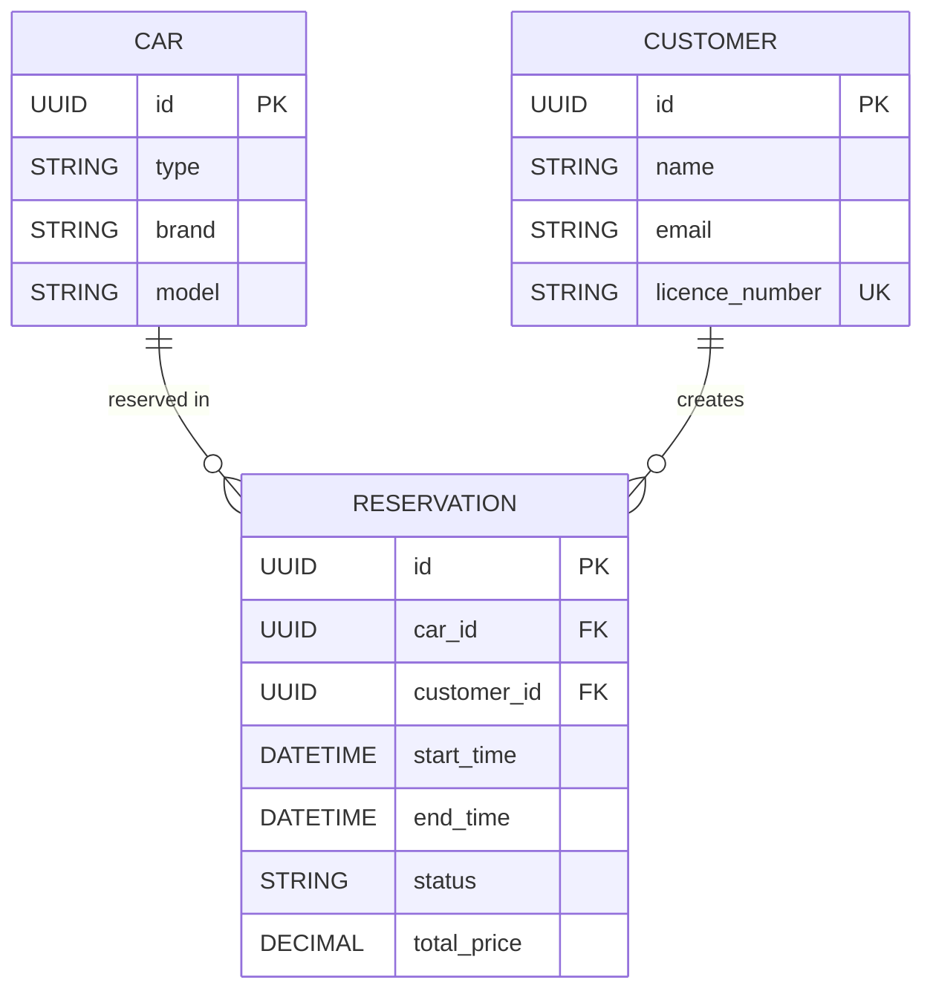

# CarRental

Spring Boot car rental service for checking availability, creating reservations, and cancelling reservations.

## 1. DB Diagram



## 2. Flow Diagram

```mermaid
flowchart TD
    A[Client request] --> B{Endpoint}
    B -->|GET /cars/available| C[Bind AvailableCarsRequest]
    C --> D[CarService.findAvailableCars]
    D --> E[Load candidate cars]
    E --> F[Check overlaps and cleaning buffer]
    F --> G[Return available offers]

    B -->|POST /reservations| H[Bind ReservationRequest]
    H --> I[ReservationService.createReservation]
    I --> J[Validate request]
    J --> K[Find specific car or any car by type]
    K --> L[Check availability]
    L --> M[Find existing customer or create new one]
    M --> N[Calculate total price]
    N --> O[Save reservation]
    O --> P[Return ReservationResponse]

    B -->|DELETE /reservations/{id}| Q[ReservationService.cancelReservation]
    Q --> R[Load reservation]
    R --> S{Status}
    S -->|RESERVED| T[Set CANCELLED and save]
    S -->|CANCELLED| U[Idempotent save]
    S -->|COMPLETED| V[Return validation error]
```

## 3. How to run with mvn

Requirements:
- Java 21
- Maven Wrapper is included in the project

Run the application:

```bash
./mvnw spring-boot:run
```

The application starts locally on:

```text
http://localhost:8080
```

Example request:

```text
http://localhost:8080/cars/available?start=2026-04-20T10:00:00&days=3&types=SUV
```

## 4. How to run tests

Run all tests:

```bash
./mvnw test
```

Run only compile for tests:

```bash
./mvnw -DskipTests test-compile
```

Run one test class:

```bash
./mvnw -Dtest=CarServiceTest test
./mvnw -Dtest=ReservationServiceTest test
./mvnw -Dtest=CarRentalControllerTest test
```

Note:
- in the current environment, Mockito runtime may require additional setup on some JDK installations

## 5. Postman collection to run local

Use the local Postman collection file:

```text
CarRental.postman_collection.json
```

Example JSON body for `POST /reservations`:

```json
{
  "carType": "SUV",
  "customerName": "Anna Kowalska",
  "email": "anna.kowalska@example.com",
  "licenseNumber": "XYZ12345",
  "start": "2026-04-20T10:00:00",
  "days": 3
}
```
